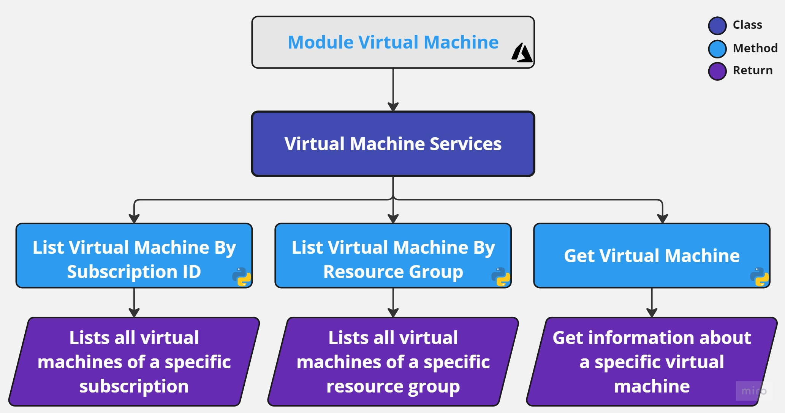

# Module Virtual Machine 
Module responsible for interacting with Azure Virtual Machine services and listing virtual machine attributes. 

## **Requirements**
- [Python 3.10 or higher](https://www.python.org/downloads/)
  
## **Installing Dependencies**
```cmd
poetry install
```

## **Authentication**
This is a Python class called AzureServices that contains methods for managing resources and tags in Azure using the Azure SDK.Additionally,
it uses env variable for get credentials 

- Export variables :
    ```txt
    AZURE_CLIENT_ID="..."
    AZURE_CLIENT_SECRET="..."
    AZURE_TENANT_ID="..."
- Or through **.secrets.toml** file at the your project's root path:
    ```txt
    CLIENT_ID=""
    CLIENT_SECRET=""
    TENANT_ID=""

## **Classes**

### *Services*

```python3
class VirtualMachineServices()
```
#
#### Methods:

#### *list_vm_by_subscription_id*
```python3
def list_vm_by_subscription_id(
    self, 
    sub_id:str
)
```
List all virtual machine existing in one subscription.

**Parameters:**

| Name | Type | Description | Default |
|---|---|---|---|
| sub_id | str | Unique identifier for an Azure subscription.  | str |
#

#### *list_vm_by_resource_group*
```python3
def list_vm_by_resource_group(
    self, 
    sub_id:str,
    rg_name:str
)
```
List all virtual machine existing in one resource group.

**Parameters:**

| Name | Type | Description | Default |
|---|---|---|---|
| sub_id | str | Unique identifier for an Azure subscription.  | str |
| rg_name | str | Unique identifier for a resource group in Azure.  | str |
#
#### *get_virtual_machine*
```python3
def list_vm_by_resource_group(
    self, 
    sub_id:str,
    rg_name:str
)
```
Get information for a specific resource group.

**Parameters:**

| Name | Type | Description | Default |
|---|---|---|---|
| sub_id | str | Unique identifier for an Azure subscription.  | str |
| rg_name | str | Unique identifier for a resource group in Azure.  | str |
| vm_name | str | Unique identifier for a virtual machine instance in Azure.  | str |
#

## **Diagram**
<center>



</center>